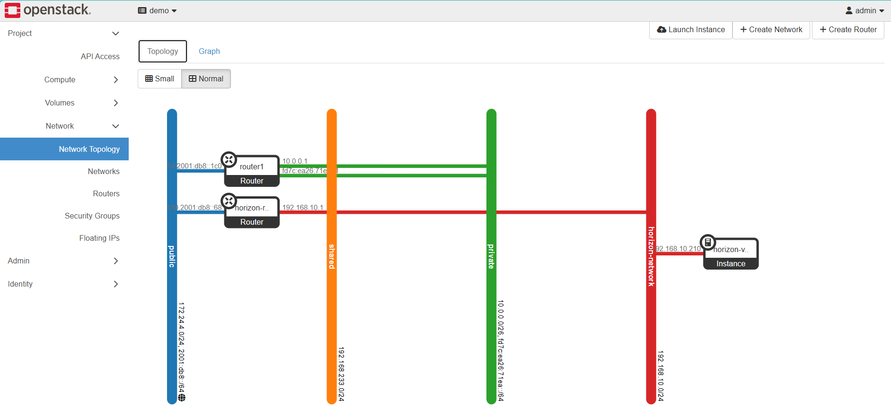
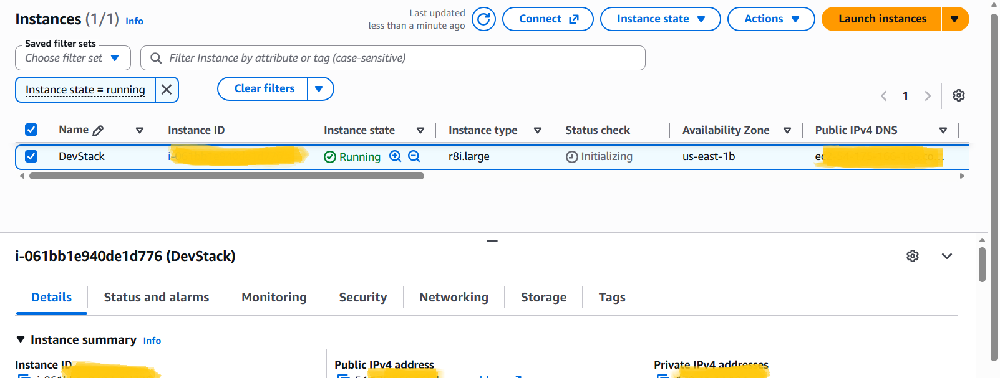
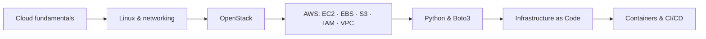

<div align="center">

# ☁️ Cloud Infrastructure & AWS Learner Lab

**Hands-on, documented and reproducible cloud labs: OpenStack, AWS, networking, storage, security and automation.**


[Overview](#-overview) · [Labs](#-labs) · [Lab 01](#-lab-01--openstack--amazon-ec2) · [Lab 02](#-lab-02--<titre-du-lab-02>) · [Structure](#-repository-structure) · [Skills](#-skills-demonstrated) · [Workflow](#-git-workflow) · [Roadmap](#-roadmap) · [Security](#-security-notes) · [Author](#-author)

</div>

---

## 📌 Overview

This repository is a progressive collection of **hands-on cloud infrastructure labs** completed during my Cloud Infrastructure Management Engineering studies at TEK-UP University.

Each lab is self-contained and includes:

- 📄 a report and/or guide (PDF),
- 🖼️ screenshots used as **evidence** of the work done,
- ✅ a knowledge check, with its corrected version when available.

The goal is to move from fundamental infrastructure concepts to **practical cloud administration, automation and DevOps workflows**, and to document every step so that it can be understood and reproduced.


---

## 🧪 Labs

| # | Lab | Main topics | Deliverables | Status |
|---|-----|-------------|--------------|:------:|
| 01 | [`Lab1_OpenStack`](./Lab1_OpenStack) | OpenStack, EC2, EBS, networking, SSH | Reports, screenshots, knowledge check | ✅ Completed |
| 02 | [`LAB02-OpenStack-Identity`](LAB02-OpenStack-Identity) | OpenStack, Keystone, identity management | Statement, report, knowledge check | ✅ Completed | | ✅ Completed |
| 03 | _To be announced_ | — | — | 🔜 Planned |

> The table is updated each time a lab is completed.

---

## 🔬 Lab 01 — OpenStack & Amazon EC2

**Focus:** a first practical introduction to cloud infrastructure management on two platforms: an open-source cloud (OpenStack) and a public cloud (AWS).

### What was done

| Area | Details |
|------|---------|
| **OpenStack** | Horizon dashboard, service list, network topology and graph, server list, floating IPs, Open vSwitch interfaces |
| **Amazon EC2** | Launching an instance, key pair creation, security group configuration, SSH access |
| **Amazon EBS** | Attaching a 50 GB block volume to an instance |
| **Linux** | Inspecting network interfaces with `ip a`, SSH connectivity checks |

### Deliverables

| Document | Description |
|----------|-------------|
| [`LAB01-OpenStack.pdf`](./Lab1_OpenStack/LAB01-OpenStack.pdf) | OpenStack lab guide |
| [`LAB01-EC2-Install-Guide.pdf`](./Lab1_OpenStack/LAB01-EC2-Install-Guide.pdf) | EC2 installation guide |
| [`Compte-Rendu-LAB01.pdf`](./Lab1_OpenStack/Compte-Rendu-LAB01.pdf) | Lab report (French) |
| [`Knowledge-Check.pdf`](./Lab1_OpenStack/knowledge-check/Knowledge-Check.pdf) | Knowledge check |
| [`Knowledge-Check-Corrige.pdf`](./Lab1_OpenStack/knowledge-check/Knowledge-Check-Corrige.pdf) | Corrected knowledge check |

### Evidence preview

<table>
  <tr>
    <td align="center"><b>OpenStack network topology</b></td>
    <td align="center"><b>EC2 instance running</b></td>
  </tr>
  <tr>
    <td></td>
    <td></td>
  </tr>
</table>

<details>
<summary><b>📷 All screenshots</b></summary>

**OpenStack** — [`Screenshots_OpenStack/`](./Lab1_OpenStack/Screenshots_OpenStack)

1. Horizon login
2. OpenStack service list
3. Network topology
4. Network graph
5. Floating IP list and SSH
6. Server list
7. Open vSwitch interfaces (`ip a`)

**EC2** — [`screenshots_EC2/`](./Lab1_OpenStack/screenshots_EC2)

1. EC2 instance running
2. EBS volume (50 GB)
3. Key pair
4. Security group
5. EC2 `ip a`

</details>

---
## 🔑 Lab 02 — OpenStack Identity (Keystone)

**Focus:** how a client authenticates against OpenStack, how it discovers services, and how Keystone and the other services isolate projects and enforce role-based access control (RBAC). Done on a DevStack environment.

### What was done

| Part | Details |
|------|---------|
| **1. From the CLI to the REST APIs** | Loading an identity with `source openrc` and the `OS_*` variables, token / service catalog / endpoints, reading the HTTP exchange behind a command with `--debug`, calling the Nova API directly with `curl` and a token, token revocation |
| **2. Projects, users and roles** | Domains, projects, users, groups and roles, creating projects and users with explicit role assignments, one profile per identity with `clouds.yaml`, groups and effective assignments |
| **3. Isolation and access control** | Multi-tenancy between two teams, a member deploying infrastructure, a user from another project (404), a read-only user (403), what a member cannot do, the admin view with `--all-projects`, where access policies are defined |


## 🗂️ Repository Structure

```text
infrastructures-cloud-aws-learner-lab/
├── Lab1_OpenStack/
│   ├── Compte-Rendu-LAB01.pdf
│   ├── LAB01-EC2-Install-Guide.pdf
│   ├── LAB01-OpenStack.pdf
│   ├── Screenshots_OpenStack/     # 7 screenshots
│   ├── screenshots_EC2/           # 5 screenshots
│   └── knowledge-check/           # knowledge check + corrected version
├── LAB02-OpenStack-Identity/
│   ├── LAB02-OpenStack-Identity-enonce.pdf
│   ├── LAB02-OpenStack-Identity-enonce.html
│   ├── Compte-Rendu-TP02-OpenStack-Identity.pdf
│   ├── Compte-Rendu-TP02-OpenStack-Identity.docx
│   └── knowledge-check/           # Keystone knowledge check + corrected version
├── .gitignore
└── README.md
```

New labs follow the same layout: `LabN_<Topic>/` with the report, screenshots and knowledge check.

---

## 🛠️ Skills Demonstrated

| Domain | Skills |
|--------|--------|
| ☁️ **Cloud** | Compute, storage and networking fundamentals; cloud service models |
| 🏢 **OpenStack** | Horizon, core services, instances, networks, routers, floating IPs, Open vSwitch |
| 🟧 **AWS** | EC2, EBS, key pairs, security groups, IP addressing |
| 🐧 **Linux** | SSH, network interface inspection, command-line administration |
| 🌳 **Git / GitHub** | Structured repository, granular commits, documented history |

**Next skills (not yet demonstrated here):** IAM, VPC, S3, Python/Boto3 automation, Terraform. See the [Roadmap](#-roadmap).


---

## 🌳 Git Workflow

Commits are small and focused, one artifact per commit, and follow [Conventional Commits](https://www.conventionalcommits.org/):

```text
docs: add Horizon login screenshot
docs: add network topology screenshot
docs: add EC2 instance screenshot
docs: add corrected knowledge check
```

Typical flow for new lab work:

```bash
git status
git add <file>
git commit -m "docs: add <description>"
git push
```

| Practice | Why it matters |
|----------|----------------|
| One folder per lab | Keeps exercises separated and easy to find |
| Meaningful, numbered filenames | Evidence is understandable without opening it |
| Granular commits | Clear, reviewable history |
| Screenshots as evidence | Proves each task was actually completed |
| Knowledge checks | Validates understanding, not only execution |

---

## 🗺️ Roadmap



- [x] Lab 01: OpenStack & Amazon EC2
- [x] AWS networking (VPC, subnets, routing)
- [ ] IAM and security
- [ ] Additional OpenStack labs
- [ ] Infrastructure as Code (Terraform)
- [ ] CI/CD

---

## 🔐 Security Notes

This repository documents cloud work, so it follows strict hygiene:

- **No credentials are committed**: no access keys, secret keys, session tokens or `.pem` private keys.
- Screenshots are reviewed to **mask sensitive data** (account IDs, public IPs, tokens) before publishing.
- Lab environments are temporary (AWS Learner Lab) and are not production systems.
- [`.gitignore`](./.gitignore) excludes key files and local configuration (`*.pem`, `*.key`, `.env`, `.aws/`).

---

## 📚 Resources

- **AWS:** [Documentation](https://docs.aws.amazon.com/) · [EC2](https://docs.aws.amazon.com/ec2/) · [Well-Architected Framework](https://aws.amazon.com/architecture/well-architected/)
- **OpenStack:** [Documentation](https://docs.openstack.org/) · [Official website](https://www.openstack.org/)
- **Linux:** [Linux documentation](https://www.kernel.org/doc/html/latest/)
- **Git:** [Git documentation](https://git-scm.com/doc)

---

## 👤 Author

**Ons Ajmi**: Cloud Infrastructure Management Engineering student, TEK-UP University, Tunisia

[](https://github.com/AjmiOns)

[](https://www.linkedin.com/in/ons-ajmi--/)

---
<div align="center">

***Learn by building. Automate by understanding. Document everything.***

</div>
